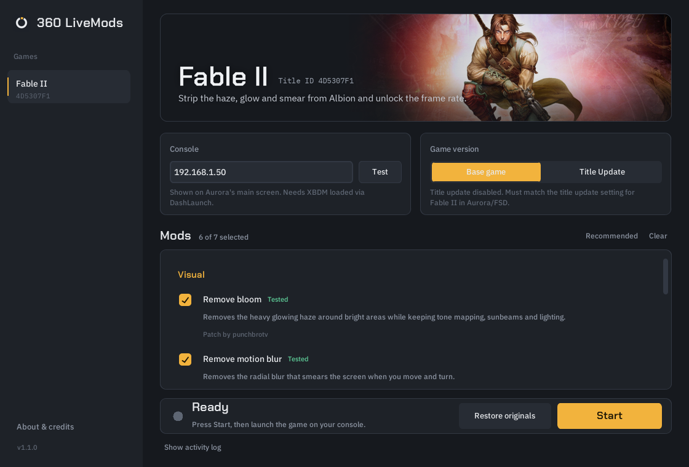
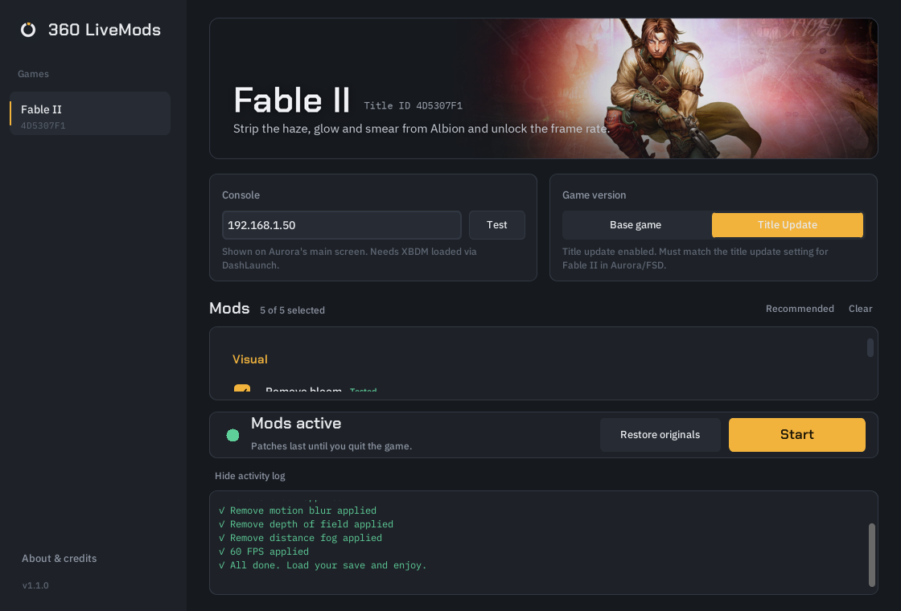

<p align="center">
  
</p>

<h1 align="center">360 LiveMods</h1>

<p align="center">
  Live, non-destructive mods for RGH/JTAG Xbox 360 consoles.<br>
  Tick the mods you want, press Start, launch your game.
</p>

<p align="center">
  
</p>

---

## What it does

360 LiveMods patches a game **in memory while it runs**, over your home network. Nothing on your
console or in your game files is modified, and nothing is installed on the console. Quit the game
and everything is back to normal.

Because the game files stay untouched, it works with your normal installed copy (disc, GOD or
extracted), and with **your existing saves**.

### Fable II

| Mod | Base game | Title update |
| --- | :---: | :---: |
| Remove bloom | ✅ | ✅ |
| Remove motion blur | ✅ | ✅ |
| Remove depth of field | ✅ | ✅ |
| Remove distance fog | ✅ | ✅ |
| 60 FPS | ✅ | ✅ |
| Native 720p (no MSAA) | ✅ | ❌ crashes on the update |
| 30 Hz tick rate | ⚠️ unstable | ❌ |

Choose **Base game** if you want 720p, or **Title Update** if your saves need the update.
All Fable II mods were tested on a real RGH console.

## Requirements

- An **RGH or JTAG** Xbox 360 with **DashLaunch**
- The **XBDM** plugin loaded through DashLaunch (in `launch.ini`, e.g. `plugin1 = Hdd:\xbdm.xex`).
  Many RGH setups already have it. JRPC2 setups use it too.
- A Windows PC on the **same network** as the console

## Install

1. Download **`360LiveMods-Setup-x.y.z.exe`** from the [Releases](../../releases) page.
2. Run it. Everything the app needs is included, so there's no Python or anything else to install.

Prefer no installer? Download the **Portable** zip, unzip it anywhere and run `360LiveMods.exe`.

> Windows may show a SmartScreen warning because the app isn't code-signed. Click
> **More info → Run anyway**. The full source is in this repository and every release is built
> automatically by GitHub Actions from it.

## Use

1. Turn the console on and stay on the **Aurora/FSD dashboard**.
2. Enter your console's IP (shown on Aurora's main screen) and press **Test**.
3. Pick your **game version**: it must match whether the game's title update is enabled in Aurora/FSD.
4. Tick the mods you want and press **Start**.
5. Launch the game. The mods are applied the moment it loads, and the status turns green.
6. Load your save and play.

Do this each time you start the game: patches last until you quit. Your IP, version and mod
choices are remembered.

<p align="center">
  
</p>

## Troubleshooting

**"No answer from the console" when testing**
Check the IP on Aurora's main screen; it can change after a reboot. Make sure XBDM is listed under
`[Plugins]` in DashLaunch's `launch.ini`, and that the PC and console are on the same network.
FTP working is not a guarantee: Aurora's FTP server is separate from XBDM.

**The status stays on "Waiting for the game"**
The selected game version doesn't match what's running. If Fable II has its title update enabled,
choose **Title Update**. The app will tell you if it detects the other version.

**The game crashes during startup**
Untick mods one at a time to find the one causing it, and please open an issue with the activity
log so it can be fixed or marked for that version.

**Nothing looks different**
Start 360 LiveMods *before* launching the game. Some settings are only read while the game boots.

## Command line

The same engine is available without the window, for scripts and power users:

```
360LiveMods.exe --list
360LiveMods.exe fable2 --ip 192.168.1.50 --version tu --mods bloom,motion_blur,dof,fog,fps60
360LiveMods.exe fable2 --ip 192.168.1.50 --version base --all
```

From source, use `python -m livemods` with the same arguments.

## Adding games

Every game is a single JSON file in [`livemods/games/`](livemods/games), plus an optional banner
image. No code changes are needed. See **[docs/ADDING_GAMES.md](docs/ADDING_GAMES.md)**. Definitions can also be dropped into
`%APPDATA%\360LiveMods\games` to try them without rebuilding.

## Building from source

```
pip install -r requirements-dev.txt
python run.py                         # run the app
python -m pytest tests -q             # tests
pyinstaller --noconfirm 360LiveMods.spec
iscc /DAppVersion=1.0.0 installer\360LiveMods.iss   # optional: the installer (Inno Setup 6)
```

Publishing a release on GitHub (Releases → Draft a new release, with a new tag such as `v1.0.1`) makes
GitHub Actions build the installer and portable zip and attach them to that release.

## Credits

- **punchbrotv**: Fable II bloom, motion blur, depth of field and fog patches ([fable2patch](https://github.com/punchbrotv/fable2patch))
- **Margen67**: Fable II 60 FPS, 1280x720 and MSAA patches
- **Guy**: Fable II tick-rate patch
- The original patches were written for the Xenia emulator. 360 LiveMods ported them to real
  hardware and to Fable II's title update, and fixed the fog patch's title-update crash.
- Fonts: Chakra Petch and IBM Plex, under the SIL Open Font License

## Disclaimer

Fable II artwork © Microsoft Corporation / Lionhead Studios, shown only to identify the game.
It will be removed on request from the rights holder.

Not affiliated with or endorsed by Microsoft, Xbox, Lionhead or any game publisher. This tool does
not contain or distribute game code. Use it at your own risk and back up your saves.

## License

[MIT](LICENSE)
